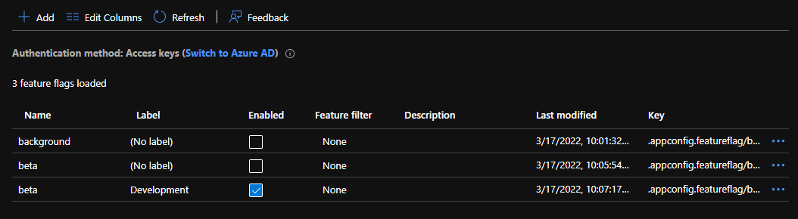
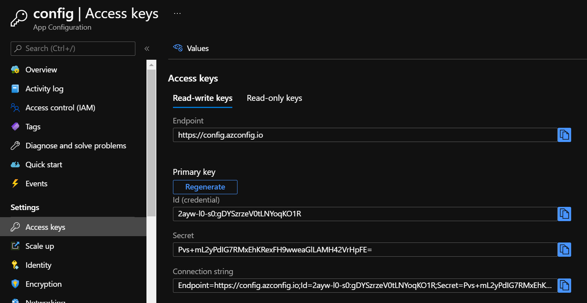

# AppSettings sample

## Configure App Config

We created an App Config. We set a few features in feature manager:

Name: beta<br />
Label: null<br />
Enabled: false<br />

Name: beta<br />
Label: Development<br />
Enabled: true<br />

Name: beta<br />
Label: Test<br />
Enabled: true<br />



---

## Storing the connection string.

We need to store the connection string to connect to App Config. We got them from the **Access Keys** blade.



Here, we stored it in appsettings.json, which is NOT the best practice.

In real life production, you would either:

1. Modify the `configuration` of your Azure App Service. Set the `Connection String` with the key `AppConfig`.
2. Set the secret in **Azure Key Vault**.

In dev mode, you would

1. Set it using `dotnet user-secrets` (This is the _Secret Manager tool_, which stores the secret in the user profile, instead of the source code.)
2. Set it in a local.appsettings.json.

Here, we set it in `appsettings.json`, which is not a best practice. because it discloses the App Config key in a file shared using git.

---

## Setting the Environment

We stored three environment in `launchsettings.json`. **Development**, **Test**, **Production**. (Additional environements are possible by modifying `launchsettings.json`)

To execute from the command line, use either of these lines.

```cmd 
    dotnet run --launch-profile dev
```

```cmd 
    dotnet run --launch-profile test
```

```cmd 
    dotnet run --launch-profile prod
```
